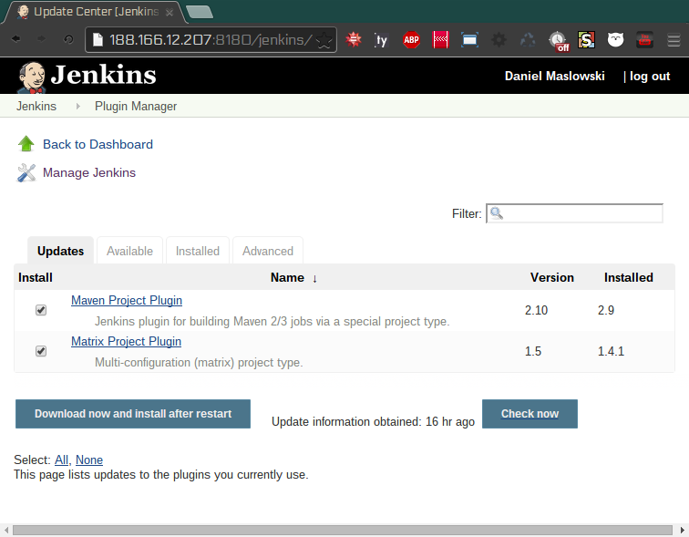
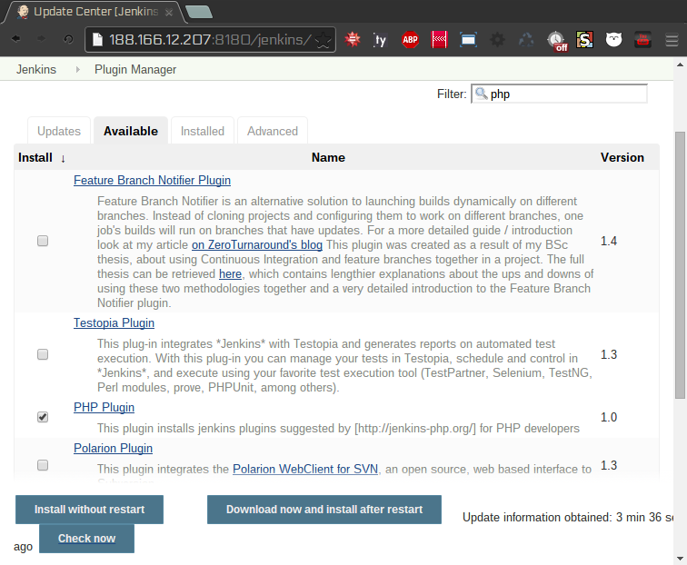
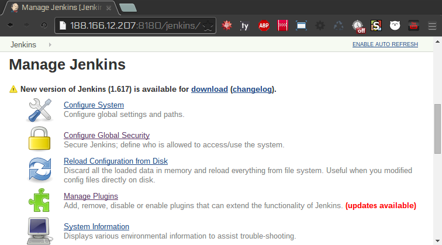

# About
This tutorial explains how to install the [Jenkins CI server](http://jenkins-ci.org/) on FreeBSD together with PHP, Node.js, git, and a couple of task runners.

## Introduction
If you develop applications with PHP (the PHP Hypertext Preprocessor), you may already have read or heard that many projects nowadays choose agile methods for quick progress. This includes test-driven development (TDD), behavior-driven development (BDD), collaboriational platforms for version control like GitHub, and finally, [Continuous Integration (CI)](http://en.wikipedia.org/wiki/Continuous_integration) comes into play. CI is basically automating what a lead developer would do in a hierarchically structured company: Analyze code that the involved team members of a project have written, run tests, make sure things work, and on success, merge the changes, new features or fixes into the main repository, or notify the committer otherwise.

# Tutorial: Install a Jenkins CI server on FreeBSD
## Prerequisites and preparation
If you set up a [FreeBSD droplet on DigitalOcean](https://www.digitalocean.com/company/blog/presenting-freebsd-how-we-made-it-happen/), simply [connect to your droplet via SSH](https://www.digitalocean.com/community/tutorials/how-to-get-started-with-freebsd-10-1) and run `sudo su` once first since almost all the following commands will require root access. Otherwise, just connect to your target machine via SSH or do whatever you prefer to have a shell and the necessary access rights.

### Update first
Before doing anything else, you should update the base system:
```
    pkg update && pkg upgrade
```

### Optional: Install an easy-to-use text editor
The editor `nano` can be installed to edit files mentioned below. This is optional however and you are free to use any other editor if you want.
```
    pkg install nano
```

## Installation
### Basic tools
To build Jenkins later, we will need the current snapshot of FreeBSD's ports tree which is versioned through SVN (subversion).

Install subversion first:
```
    pkg install subversion
```
And then fetch the current tree:
```
    portsnap fetch extract
```
This will take quite some minutes, so you can read on in the meantime.

### Build and install Jenkins
The following steps are what you can also find on the [Jenkins website](https://wiki.jenkins-ci.org/display/JENKINS/Installing+Jenkins+inside+a+FreeNAS+jail) except for the JDK which we will install from the binary repository.

Jenkins is written in Java. Thus, first install the Java Development Kit (JDK):
```
    pkg install openjdk8
```
Then install Jenkins from the port:
```
    cd /usr/ports/devel/jenkins
    make install clean BATCH=yes
```

### Task runners, Node.js, OpenSSL, PHP and modules
The key tools for automation are task runners. Many of them exist in many languages, so let's focus on a few of them.

Popular Java Task runners are Gradle and Ant:
```
    pkg install gradle apache-ant
```

JavaScript developers often use Grunt to build their projects, so install Node.js and npm, the Node.js package manager:
```
    pkg install node npm
```
Grunt itself is installed through npm. The package name is, however, grunt-cli, because it has been [split up to support multiple version](http://gruntjs.com/getting-started):
```
    npm install -g grunt-cli
```

To run tests for your PHP project, install it as well as the modules which you also have on your development machine:
```
    pkg install php56-fileinfo php56-iconv php56 php56-json php56-mbstring php56-session php56-tokenizer php56-xmlwriter php56-xsl
```

For package management in PHP, install `composer`:
```
    pkg install php-composer
```

To support composer packages that are hosted on GitHub, also install `git` and `openssl`:
```
    pkg install openssl git
```

## Configuration

### PHP
PHP will need some configuration to work with OpenSSL. Create a symlink for your `php.ini`:
```
    cd /usr/local/etc/
    ln -s php.ini-development php.ini
```
OpenSSL stores certificates in these locations:
```
    php -r "print_r(openssl_get_cert_locations());"
```
Add the local certificate to php.ini using nano or your preferred editor:
```
    nano php.ini
```
Far at the bottom you will find this line (you can scroll down in nano with PgDown):
```
    ;openssl.cafile=
```
Add this line below (in nano you can just use press return for a new line and type):
```
    openssl.cafile=/usr/local/etc/ssl/cert.pem
```
You should also set your timezone here. The corresponding line is (in nano, search with Ctrl+w, enter `timezone` and press return):
```
    ;date.timezone =
```
The value should be a string like the following (assuming you're in Central Europe, just enter the value like you did with openssl.cafile):
```
    date.timezone = Europe/Berlin
```
Then save the changes (Ctrl+X, then `y` to confirm and enter in nano).

### Jenkins
To have Jenkins started at system boot, add it to `rc.conf`:
```
    echo 'jenkins_enable="YES"' >> /etc/rc.conf
```
To start the service now:
```
    service jenkins start
```

You can then access Jenkins' web interface on `http://your-droplet:8180/jenkins/` and begin configuring it. The first start will take a few minutes.


You will then be presented with the overview page.


Click on "Manage Jenkins" and look a bit further down to see hints on configuration.


**Attention**: Set up access controls first since this instance is now exposed and anyone may try to access it.


A quick way to set it up is the following:
- Click the "Setup Security" button (or "Configure Global Security")
- Check "Enable security"
- Set "Security Realm" to "Jenkins' own user database"
- Set "Authorization" to "Logged-in users can do anything"
- Click "Save"
- Register an account (link in the upper right)
- Go back to the security settings
- Uncheck "Allow users to sign up"

Now if you login again with your newly created user, you will be presented the overview page again.


Before installing the plugins you need to build your project, update all the plugins that are currently installed.



This will take some time again because the new versions have to be downloaded first and then applied.


Finally, restart Jenkins:
```
    service jenkins restart
```

To enable support for the various tools we have just installed, install the respective plugins through the web interface as well. Navigate to the "Manage Plugins" page again, click on the "Available" tab and use the search field to find them quickly, since Jenkins offers a huge list of plugins. You will at least need:
- php
- Git plugin
If you there is anything else you find interesting, feel free to install it as well.



## Upgrading
If updates are available, Jenkins will notify you.



To upgrade Jenkins itself, do so from the ports tree. Connect to your FreeBSD machine, get root access and update your ports tree:
```
    portsnap fetch update
```
Then build and reinstall Jenkins:
```
    cd /usr/ports/devel/jenkins
    make reinstall clean BATCH=yes
```
And restart the service:
```
    service jenkins restart
```

## Finish
That's it, you now have a basic installation of Jenkins for PHP and JS development. Plese refer to [the documentation](https://wiki.jenkins-ci.org/display/JENKINS/Home) for more details and set up your first project. Good luck and happy building!
